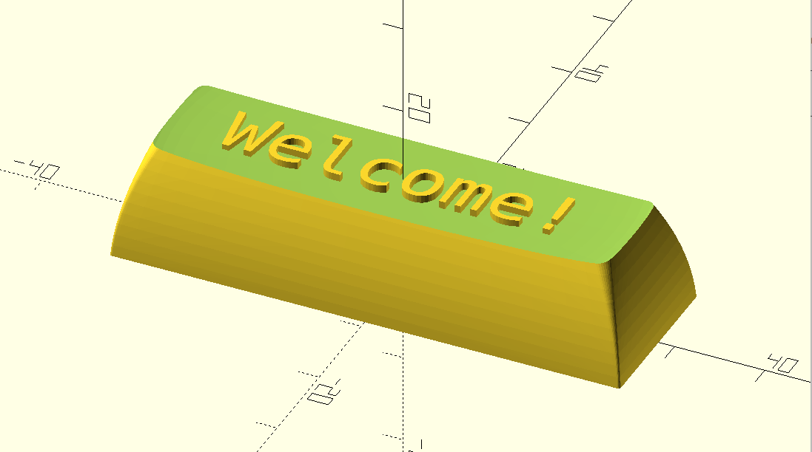
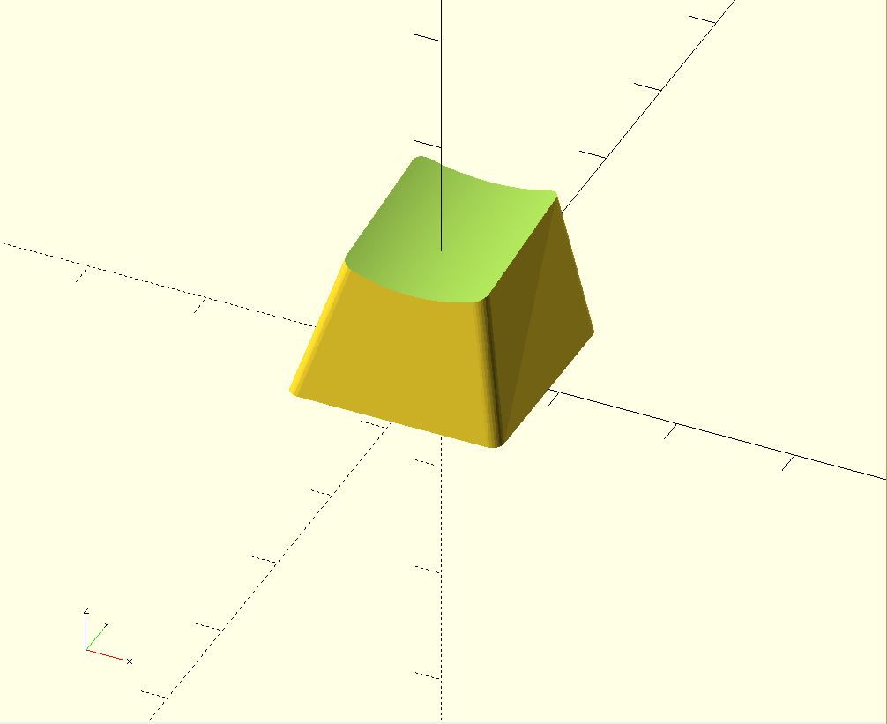
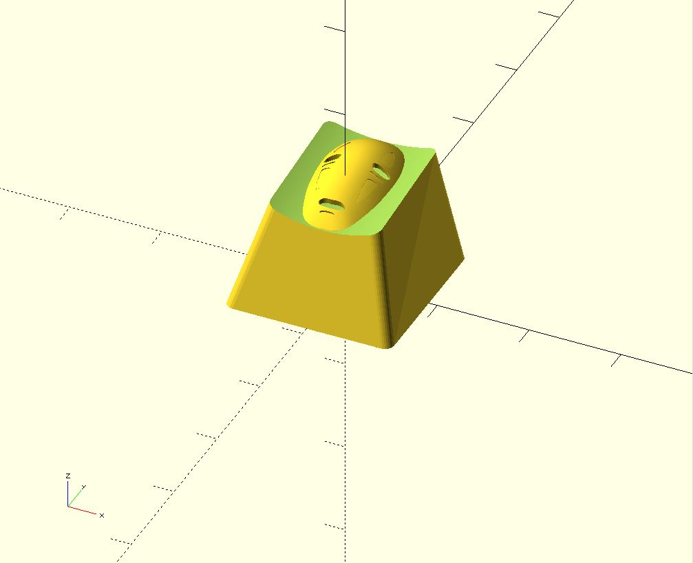
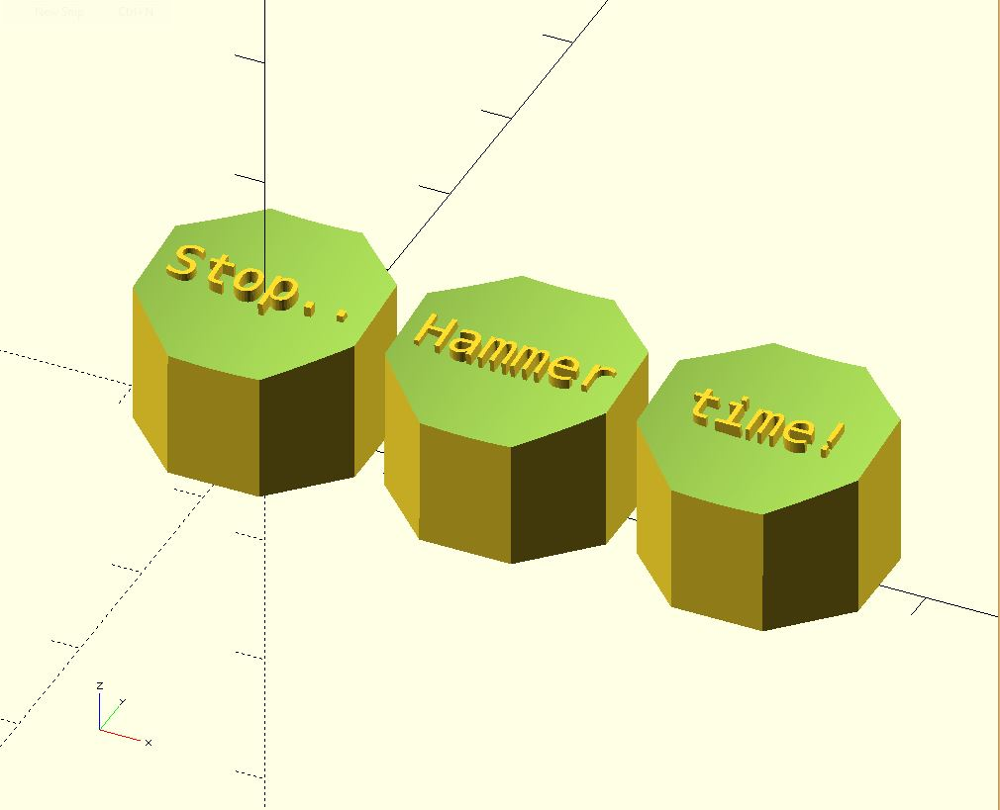

# Parametric Mechanical Keycap Library



This library is a keycap and keyset construction library for mechanical keyboards, written in openSCAD.

Relevant links:
* Thingiverse: https://www.thingiverse.com/thing:2783650
* Shapeways: https://www.shapeways.com/designer/rsheldiii/creations

## How to run

#### Thingiverse Customizer

The easiest (though not the best) way to run this program is to boot it up in [Thingiverse's Customizer](https://www.thingiverse.com/apps/customizer/run?thing_id=2783650). Explanations of each option are provided, as well as some default variables. Twiddle the variables to see how the keycap changes!

#### OpenSCAD Customizer

If you find that the Thingiverse Customizer is timing out, but you're not technically inclined enough to start programming in OpenSCAD, you can look into [getting OpenSCAD's customizer working](https://github.com/rsheldiii/KeyV2/wiki/Getting-the-OpenSCAD-Customizer-working).

#### OpenSCAD Proper

First, you'll need OpenSCAD: http://www.openscad.org/downloads.html. I highly recommend installing the development snapshot, as they are much further along than the current stable release (as of writing, 2015.03-3).

After you have openSCAD installed, you need to download the code and run it. running `git clone https://github.com/rsheldiii/openSCAD-projects.git` if you have git, or downloading [this zip](https://github.com/rsheldiii/openSCAD-projects/archive/master.zip) and extracting the code should do it. Then all you need to do is open `keys.scad` with openSCAD and you are set! It is possible to edit this project with an external editor by checking off Design => Automatic Reload and Preview in OpenSCAD.

All examples below assume you are running the library on your computer with OpenSCAD.

## High-level overview

This library supports Cherry and Alps switches, and has pre-defined key profiles for SA, DSA, DCS, G20, Hi-Pro and (some form of) OEM keycaps. `keys.scad` is the entry point for everything but the most technical use. Pre-programmed key profiles can be found in the `key_profiles` directory.

Every key starts with defaults that are overridden by each function call. The simplest cherry key you can make would be:

```
key();
```



which is a bog-standard DCS row 5 (number / function row) keycap. To change how the key is generated, you add predefined modifier functions like so:

```
sa_row(2) 2u() key();
```

You can chain as many modifier functions as you like!


## Tweaking individual keycaps

There is a bevy of supporting functions to customize your keycaps. You can add a brim to more easily print the stem with `brimmed_stem_support`, make 2x2 keycaps with `2u() 2uh()`, add legends, rotate stems, and more. These functions can be found in `key_profiles/` for different keycap profiles, `key_types.scad` for predefined settings for common keys (spacebar, left shift, etc), `key_sizes.scad` for common unit sizes, and `key_transformations.scad` for everything else. For a full list of helper functions with explanations, [Check out the wiki!](https://github.com/rsheldiii/KeyV2/wiki/KeyV2-Helper-Documentation)

These modifier functions don't cover everything; in that case, you may have to write some SCAD yourself.

#### Example customizations

Let's say you wanted to generate some 2u stabilized keycaps for an Ergodox, you could do something like this:

```
legends = ["Enter", "Escape", "Tab", "Shift"];
for(y=[0:3]) {
  translate_u(0,y) 2u() dsa_row() stabilized() cherry() key(inset=true) { keytext(legends[y], [0,0], 6); }
}
```


The `key()` function also supports children, and will place them in the center of the top of the keycap, if you want to quickly design your own artisan keycaps:

```
cherry() key() {
  translate([-6.25,2.3,-0]) scale(0.074) import("Assieme1.stl");
};
```



(no face courtesy of [this thing](https://www.thingiverse.com/thing:519727/))

Artisan support also supports _subtracting_ children by doing `key(inset=true) { ... }`, which is super helpful if you want to make keycaps with legends that are not text. The children will be placed just above the middle of the dish as per usual; you will need to translate them downwards (`ex translate([0,0,-1])`) to get them to 'dig in' to the top of the key.

## What if I want to get _really_ technical?

Now we're talkin!

At the base level this project should function well as an intensive key profile design library. by loading up `src/key.scad` (notice no s) you can tweak variables in `src/settings.scad` to prototype your own profiles. `key.scad` There are currently ~~44~~ a lot of different settings to tweak in `src/settings.scad` including width height and depth of the keycap, dish tilt, top skew, fonts, wall thickness, etc. If you want to see the full list of settings, feel free to browse the file itself: [settings.scad](https://github.com/rsheldiii/KeyV2/blob/master/src/settings.scad) it has lots of comments to help you get started.

This library should also be abstract enough to handle new dish types, keystems, key layouts, key profiles, and key shapes, in case you want to design your own Typewriter-style keycaps, support buckling spring keyboards or design some kind of triangular dished profile. `src/shapes.scad` `src/stems.scad` and `src/dishes.scad` all have a 'selector' module that should allow you to implement your own creations alongside what already exists in their constituent folders.

If you're interested in this, it may help to read the [Technical Design of a keycap](https://github.com/rsheldiii/KeyV2/wiki/Technical-Design-of-a-Keycap) wiki page.

Here's an example of tweaking the settings and code to make a 'stop sign' key profile:

In `key_shape()` in `shapes.scad`:

```
 else if ($key_shape_type == "stop_sign") {
   stop_sign_shape(size, delta, progress);
 }
```

in `src/shapes/stop_sign.scad`:

```
module stop_sign_shape(size, delta, progress){
  rotate([0,0,22.5]) circle(d=size[0] - delta[0], $fn=8);
}
```

In `keys.scad`:

```
union() {
  // make the font smaller
  $font_size = 3;
  // top of keycap is the same size as the bottom
  $width_difference = 0;
  $height_difference = 0;
  $key_shape_type="stop_sign";
  $dish_type = "cylindrical";
  // some keycap tops are slid backwards a little, and we don't want that
  $top_skew = 0;

  legends = ["Stop..", "Hammer", "time!"];

  for(x=[0:len(legends)-1]) {
    translate_u(x) cherry() key(legends[x]);
  }
}
```



## Printing Help

Prints from this library are still challenging, despite all efforts to the contrary. Resin printers can create great looking keycaps; FDM printers can create usable keys that look alright, but may require tweaking to get prints acceptable. There are a few quick things that you can do:

1. If your stem isn't fitting in the switch, try upping the slop factor, accessed by giving your keystem function a numeric value (eg `cherry(0.5) key()`). This will lengthen the cross and decrease the overall size of the keystem. The default value is 0.3, and represents millimeters. Note that even if you have a resin printer, you should probably keep the default value; keys printed with 0 slop will barely fit on the stem.

2. If your keystem breaks off the bed mid-print, you can enable a brim by adding the `brimmed()` modifier. This will give a solid base for the keystem to anchor into.

3. If you are unsatisfied with the quality of the top surface, you can try printing the keycap on a different surface than the bottom, though it may impact the quality of the stem.

4. If your newly-designed key shape is crashing into the switch, you can enable a clearance check for cherry switches by adding `$clearance_check = true;` to your keycap declaration. This will subtract a cherry switch shape from your keycap, highlighting any parts in red which intersect with the switch.

That's it, if you have any questions feel free to open an issue or leave a comment on thingiverse!

## TODO:
 * replace linear_extrude_shape_hull with skin_extrude_shape_hull or something, to enable concave extrusions
 * replace current ISO enter shape with one that works for `skin()`
 * generate dishes via math?

## Contributions welcome

 My lists of key profiles and layouts are not exhaustive at all, if you want to contribute feel free to make a PR with your changes and we can work together on getting it merged!
